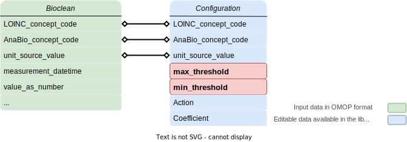

# Cleaning

The pipeline is structured in 3 stages:

- [Extract Concepts-sets][2-extract-concepts-sets]
- [Normalize units][3-normalize-units]
- [Detect outliers][4-detect-outliers]


## Definitions

The *BioClean* module focuses on two **OMOP** terms:

- [**measurement**](https://www.ohdsi.org/web/wiki/doku.php?id=documentation:vocabulary:measurement) is a record obtained through the standardized testing or examination of a person or person's sample. It corresponds to a row in the [Measurement](https://www.ohdsi.org/web/wiki/doku.php?id=documentation:cdm:measurement) table.
- [**concept**](https://ohdsi.github.io/TheBookOfOhdsi/StandardizedVocabularies.html#concepts) is a semantic notion that uniquely identify a clinical event. It can group several measurements.

A third term was created to ease the use of the two above:

- [**concepts-set**](../../datasets/concepts-sets.md) is a generic concept that has been deemed appropriate for most biological analyses. It is a group of several biological concepts representing the same biological entity.

**Example:** <br/>
Let's imagine the laboratory X tests the creatinine of Mister A and Mister B in mg/dL and the laboratory Y tests the creatinine of Mister C in µmol/L. In this context, the dataset will contain:

- 3 measurements (one for each conducted test)
- 2 concepts (one concept for the creatinine tested in mg/dL and another one for the creatinine tested in µmol/L)
- 1 concepts-set (it groups the 2 concepts because they are the same biological entity)

## 1. Input

The *BioClean* table is based on three tables provided by the data-scientist in **OMOP** format:

- [Measurement](https://www.ohdsi.org/web/wiki/doku.php?id=documentation:cdm:measurement)
- [Concept](https://www.ohdsi.org/web/wiki/doku.php?id=documentation:cdm:concept)
- [Concept Relationship](https://www.ohdsi.org/web/wiki/doku.php?id=documentation:cdm:concept_relationship)

The [Concepts-set](../../datasets/concepts-sets.md) table contains the meta-concepts of interest for the user.


## 2. Extract concepts-sets

In order to work on the measurements of interest, the user can extract a list of concepts-sets by:

- Selecting [default concepts-sets](../../datasets/concepts-sets.md) provided in the library which represent common biological entities.
- Editing [default concepts-sets](../../datasets/concepts-sets.md) if needed, modifying the codes of a selected default concepts-set.
- Creating a concepts-set from scratch.

```python
from eds_scikit.biology import ConceptsSet

hemoglobin = ConceptsSet("Hemoglobin_Blood_Quantitative") # (1)
hemoglobin.concept_codes.append("C87545") # (2)
my_custom_concepts_set = ConceptsSet(
    name="Custom_entity",
    concept_codes=["A2458", "B87985"],
) # (3)

my_concepts_sets = [my_custom_concepts_set, hemoglobin]
```

1. Select default concepts-set by giving the name of a [default concepts-set][concepts-sets]
2. Edit default concepts-set
3. Create new concepts-set from scratch

!!!warning "Disclaimer"
    The list of [default concepts-set][concepts-sets] is still in progress. We update it regularly and you are welcomed to contribute. See our [contributing guidelines][contributing].
## 3. Normalize units

The `bioclean` function converts to the same unit all the measurements of the same concepts-set. This feature is based on a csv configuration file listing the conversion coefficients of the [default concepts-set](../../datasets/concepts-sets.md).


!!! warning "Manually set"
    For the moment, there is no automatic unit conversion and the ``Coefficient`` column has to be set manually if you want to create your own configuration.

## 4. Detect outliers

It detects outliers based on the Median Absolute Deviation (MAD) Methodology[@madmethodology]. This statistical method computes the ``max_threshold`` and ``min_threshold`` columns.



!!! aphp "Statistics"
    The [default configuration](../../datasets/biology-config.md) file is based on statistical summaries of the AP-HP's Data Warehouse and is especially well fitted for it.

If needed, you can create your own configuration file by using the statistical summaries of your data. For more details, please see the [tutorial][tutorial].

\bibliography
